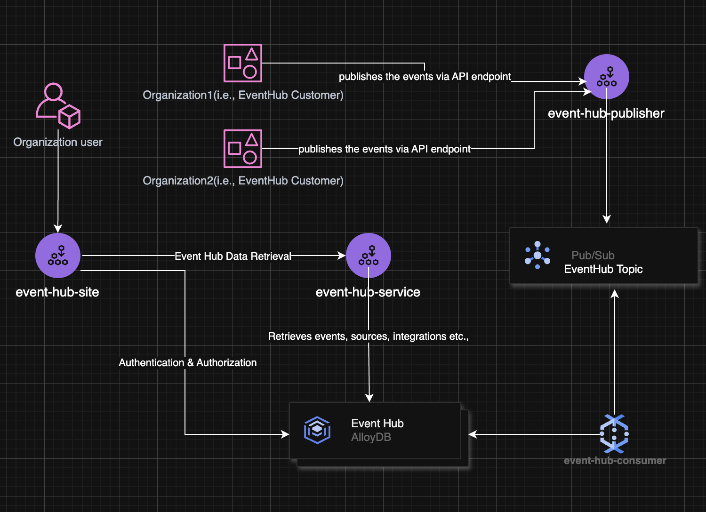

# Event Hub DB Server
This DB server hosts the data of organizations events, sources and integrations.

## Running persistent Alloy DB server on docker
docker compose up -d
## Initial SQL files execution
This step needs to be executed only if you are running the AlloyDB for the first time

- First connect to Alloy DB from a CLI or from a UI tool like DBeaver.
- Run the sql files in sequence (files are under sql folder)
    - 1_database.sql
    - 2_organization.sql
    - 3_role.sql
    - 4_user.sql
    - 5_workspace.sql
    - 6_source.sql
    - 7_target.sql
    - 8_event_definition.sql
    - 9_event.sql